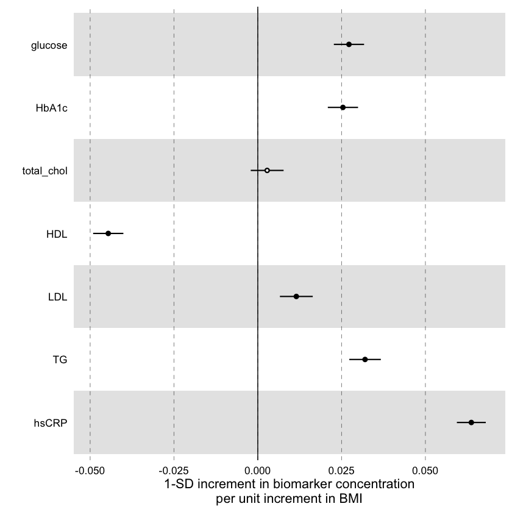
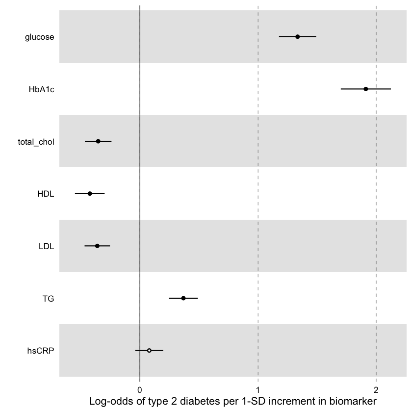

# Nhanes Dataset Biomarker Analysis

## Research question

Which standard clinical biomarkers are associated with BMI, and which are associated with diagnosed diabetes, using a public clinical dataset (NHANES 2017-2018)?

## Data

**Source:** [NHANES 2017-2018](https://wwwn.cdc.gov/nchs/nhanes/continuousnhanes/default.aspx?BeginYear=2017) (National Health and Nutrition Examination Survey), U.S. Centers for Disease Control and Prevention. Public-use files, no registration required.

**Retrieved:** June 2026 via the [nhanesA](https://cran.r-project.org/package=nhanesA) R package, which downloads directly from CDC servers.

**Modules used:** Demographics (DEMO_J), body measures (BMX_J), fasting glucose (GLU_J), HbA1c (GHB_J), total cholesterol (TCHOL_J), HDL (HDL_J), LDL and triglycerides (TRIGLY_J), hsCRP (HSCRP_J), diabetes questionnaire (DIQ_J).

**Size:** 9,254 participants at download time. The analysis is restricted to the 2,738 participants with all seven biomarkers available. Glucose, LDL and triglycerides were measured only in people who fasted, which is why most participants are excluded. Participants are aged 12 to 80 (median 47). Adolescents (12 to 17) are included, and NHANES records every age above 80 as 80.

**Note on scope:** NHANES provides standard clinical biomarkers (HbA1c, total cholesterol, HDL, LDL, triglycerides, hsCRP, glucose). It does not include NMR metabolomics. This repo applies the [Nightingale Health NMR tutorial](https://nightingalehealth.github.io/ggforestplot/articles/nmr-data-analysis-tutorial.html) workflow as a methods exercise on a comparable dataset; it does not replicate Nightingale's NMR panel.

## Method

Each biomarker is log-transformed and z-standardised (mean 0, SD 1) before modelling, so regression estimates are comparable across biomarkers with different measurement scales.

**Linear regression (BMI associations):** one model per biomarker, `biomarker ~ BMI + age + sex`. Multiple testing corrected with Benjamini-Hochberg (BH) FDR across 7 tests.

**Logistic regression (diagnosed diabetes):** one model per biomarker, `diabetes ~ biomarker + age + sex + BMI`. Diabetes is coded as binary: "Yes" and "Borderline" = 1 (80 subjects), "No" = 0. BH correction applied across 7 tests. 

## Results

**BMI associations (linear regression, n = 2,738):**

6 of 7 biomarkers are significantly associated with BMI after BH correction. Only total cholesterol is not (BH-adjusted p = 0.27). hsCRP shows the strongest association (estimate: 0.064 SD per BMI unit, p.adjusted = 2.6e-160). HDL is inversely associated (higher BMI, lower good cholesterol).



**Diabetes prediction (logistic regression, n = 2,738):**

HbA1c (log-odds 1.91) and glucose (log-odds 1.33) are the strongest predictors, as expected given their direct relationship to blood sugar. hsCRP, despite being the dominant BMI-associated biomarker, is not significant after adjusting for BMI (p = 0.19), suggesting its association with diabetes is mediated by obesity.



**Robustness check: "Borderline" answers.**

The logistic regressions were repeated without the 80 participants who answered "Borderline" (n = 2,658). No association changed direction, and the ranking of biomarkers by size was the same. Estimates were about 10 to 24% larger without them. hsCRP remained unassociated with diabetes (adjusted p = 0.18).

## Limitations
- **Survey weights were not used.** NHANES uses a complex stratified sample, and its weights are needed for results to represent the U.S. population. This analysis uses plain `lm()` and `glm()` without the `survey` package, so the results describe the 2,738 participants analysed.
- **Self-reported outcome.** Diabetes is self-reported (a doctor told the participant). "Borderline" answers are counted as diabetes in the main analysis, which gives more positive cases than a strict clinical definition. See the robustness check above.

## How to reproduce

**Requirements:** [conda](https://docs.conda.io/en/latest/miniconda.html)

```bash
git clone <repo>
cd metabolomics_nightingale
conda env create -f environment.yaml
conda activate metabolomics_nightingale
jupyter lab
```

Open `analysis.ipynb` and select the **R** kernel. Run the setup cell first; it installs `nhanesA` and `ggforestplot` on first run (takes a few minutes). Then run all cells in order.


## License

Code: [MIT](LICENSE). Data: downloaded from CDC NHANES public-use files (no licence restrictions on use).
